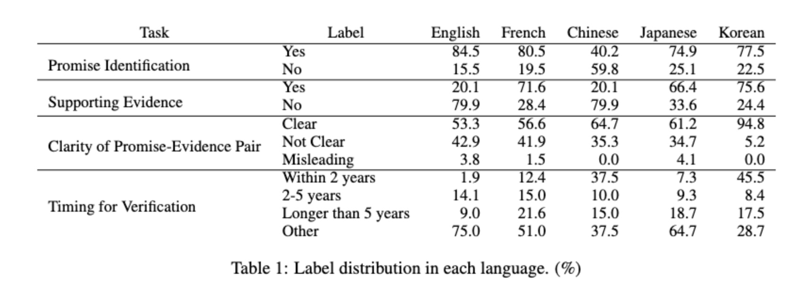
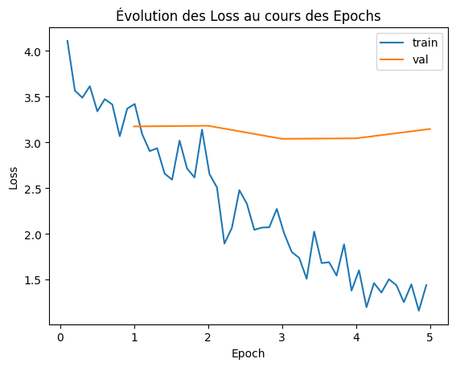
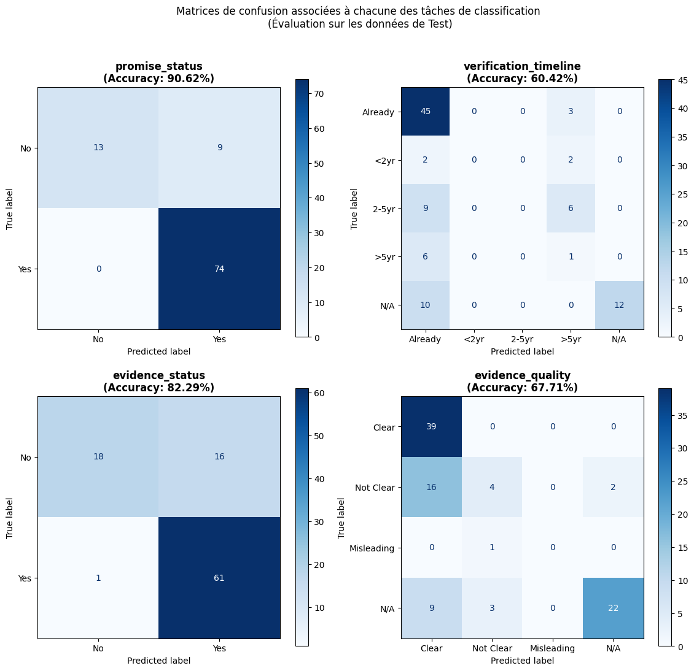
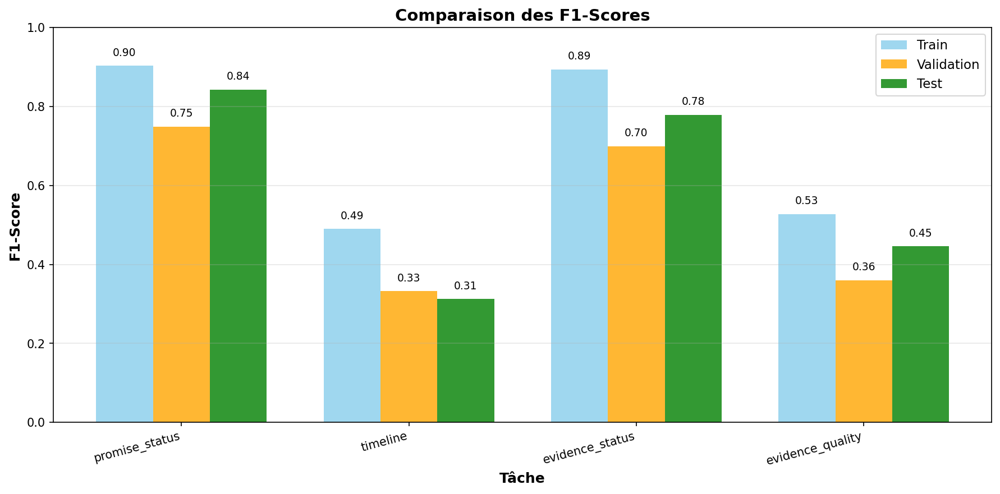

# Multilingual BERT Greenwashing Detector

Automated semantic analysis of CSR commitments to detect potential forms of greenwashing (NLP)

***

## Abstract

_**English version**_ 
As organizations increasingly leverage CSR commitments to shape public perception, the verifiability of these promises becomes a transparency stake. This project introduces a multilingual BERT-based heterogeneous multi-task classifier, an automated NLP tool for evaluating the credibility of statements from Corporate Social Responsibility (CSR) reports in French and English, preventing potential greenwashing. The multi-task learning system predicts four dimensions (promise detection, timeline clarity, evidence assessment, proof quality), then combines them via a hybrid scoring method (rule-based + probabilistic) to output a greenwashing risk score (0-100).

_**French version**_ 
À mesure que les organisations exploitent les engagements RSE pour façonner la perception publique, la vérifiabilité de ces promesses devient cruciale. Ce projet introduit un classificateur multi-tâches hétérogène basé sur le modèle BERT multilingue. Il s'agit d'un outil de NLP pour évaluer de façon automatisée la crédibilité des déclarations et engagements pris au sein de rapports de Responsabilité Sociétale des Entreprises (RSE), en français et en anglais, permettant ainsi de détecter et limiter les risques de greenwashing. Le système d'apprentissage multi-tâches prédit quatre dimensions (détection de promesses, clarté temporelle, évaluation des preuves, qualité des justifications), puis les combine via une méthode de calcul hybride (basée sur des règles + probabiliste) pour produire un score de risque de greenwashing (0-100).

## Context & Problem Statement

Nowadays, communication shapes public perception. Whether in the political, entertainment, or industrial sectors, ambitious ethical declarations and commitments are essential for projecting an image of integrity and responsibility. Companies, in particular, seek to present a positive image of their actions by highlighting their commitments to Corporate Social Responsibility (CSR) through periodic reports.

However, the increasing complexity of these promises, the frequent absence of measurable indicators, and the multiplicity of announced time horizons make it difficult to evaluate their credibility. A question then arises: are these promises grounded in verifiable actions, or are they mere "greenwashing"? This phenomenon refers to cases where an organization promotes sustainability actions and positive environmental impact to project a virtuous image, without implementing concrete actions to achieve these commitments.

Given this challenge of transparency and combating misinformation, an automated and systematic analysis approach becomes essential to rigorously evaluate the strength, verifiability, and credibility of CSR commitments declared by organizations.

## Objectives

The "Multilingual BERT Greenwashing Detector" project aims to develop an automated evaluation tool for text excerpts from CSR reports.

### Phase 1: Multi-dimensional Predictions

The tool identifies 4 key dimensions to characterize each statement:
- **Promise presence**: Does the excerpt contain a commitment or promise?
- **Verifiability**: Is the promise supported by evidence internal to the report?
- **Temporal clarity**: Is a clear timeframe or deadline established?
- **Evidence quality**: Are the proofs clear, vague, or misleading?

### Phase 2: Greenwashing Risk Scoring

Based on these predictions, the tool calculates a **greenwashing risk score (0-100)**:
- **Score ≈ 0**: credible and well-supported statement
- **Score ≈ 100**: high greenwashing risk (promise without verifiable proof)

### Purpose

This tool enables stakeholders (investors, NGOs, consumers) to quickly and objectively evaluate the strength of CSR commitments declared by a company.

### Multilingual Coverage

The tool currently supports French and English.

## Data

The project uses the **ML-Promise** dataset, introduced in the paper _ML-Promise: A Multilingual Dataset for Corporate Promise Verification_. It contains 2000 paragraphs extracted from CSR reports in 5 different languages.

**Linguistic coverage for this project:**
- French: 400 paragraphs
- English: 400 paragraphs
- Total: 800 paragraphs

**Description of the dataset distribution:** 

## Methodology

### 1. Data Preparation Pipeline

**Numerical encoding**:
Categorical variables converted to numerical values, necessary for the learning phase.

**Tokenization**:
- Tokenizer: `bert-base-multilingual-cased` (HuggingFace)
- Max_length: 289 tokens (set at the 80th percentile of the distribution) → balance between information preservation and computational efficiency
- Sliding window: for paragraphs > Max_length
- Result: 800 paragraphs → 980 sequences after splitting

**Data Split**:

| Dataset | % |
|---------|---|
| Train | 80 |
| Validation | 10 |
| Test | 10 |

### 2. Heterogeneous Multi-task Classifier Architecture

The model is based on fine-tuning `bert-base-multilingual-cased`.

**Components**:
- **BERT Encoder**:
  - Embedding layer
  - 12 Transformer blocks
  - Extraction of the final [CLS] token representation (global context vector)

- **4 independent classification heads**:
  - `Promise Status` (2 classes)
  - `Verification timeline` (5 classes)
  - `Evidence Status` (2 classes)
  - `Evidence Quality` (4 classes)

Model Architecture Diagram:
![Model Architecture Diagram: ]
(figures/BERT Multi-tasks classifier.png)

**Hyperparameters**:
- Learning rate: 2e-5
- Batch size: 8
- Epochs: 5
- Optimizer: AdamW
- Regularization: Dropout 0.3 + L2 (0.01)

### 3. Greenwashing Score

| Verification timeline | Weight |
|---|---|
| Already | 100 |
| <2 years | 90 |
| 2-5 years | 80 |
| >5 years | 50 |
| N/A | 0 |

| Evidence status | Weight |
|---|---|
| Yes | 100 |
| No | 0 |

| Evidence quality | Weight |
|---|---|
| Clear | 100 |
| Not clear | 40 |
| Misleading | 0 |
| N/A | 30 |

**Formula**:

Score = 100 - (average of predicted class weights, weighted by their respective probabilities)

**Mathematically**:

$$\text{Score} = 100 - \frac{1}{3} \sum_{i=1}^{3} \left( \sum_{c=1}^{n_i} w_{i,c} \cdot p_{i,c} \right)$$

Where:
- $w_{i,c}$ = weight associated with class $c$ of task $i$
- $p_{i,c}$ = predicted probability for class $c$ of task $i$
- The 3 tasks are: Timeline, Evidence Status, Quality (Promise excluded from scoring)
- Each task contributes 1/3 of the final score

## Results

**Detailed Performance across Train/Val/Test datasets**:

| Task | Dataset | Accuracy | F1-score | Epoch |
|------|---------|----------|----------|-------|
| **Promise Status** | Train | 92% | 0.89 | 5 |
| | Val | 87% | 0.81 | 5 |
| | Test | 91% | 0.84 | - |
| **Evidence Status** | Train | 88% | 0.86 | 5 |
| | Val | 76% | 0.75 | 5 |
| | Test | 82% | 0.83 | - |
| **Evidence Quality** | Train | 72% | 0.48 | 5 |
| | Val | 61% | 0.42 | 5 |
| | Test | 68% | 0.45 | - |
| **Verification Timeline** | Train | 65% | 0.36 | 5 |
| | Val | 54% | 0.30 | 5 |
| | Test | 63% | 0.35 | - |

**Convergence Curve:** 

**Confusion Matrices:** 

**F1-Score Comparison:** 

## Critical Analysis

### Strengths
- Strong performance on binary tasks (Promise Status, Evidence Status)
- Stable model (no train/validation divergence)
- Correct generalization despite limited dataset

### Identified Weaknesses
- More complex predictions on multi-class tasks
- The Timeline task is very difficult to predict (semantic ambiguity between temporal classes)
- Slight overfitting after 2–3 epochs
- Class imbalance
- Relatively small dataset

### Probable Causes
- Class imbalance
- Annotation subjectivity: particularly for Quality and Timeline
- Small dataset: 800 examples insufficient for multi-task fine-tuning

## Improvement Perspectives

**Short term**:
- Class re-balancing via "weighted loss" method
- Addition of "Early stopping" to prevent overfitting
- Data augmentation via LLM-based paraphrasing methods

**Medium/long term**:
- Additional manual annotations of real CSR reports (time-consuming)

***
***

## Author

Matthieu Gérénius

## References

- Seki, Y., Shu, H., Lhuissier, A., Lee, H., Kang, J., Day, M.-Y., & Chen, C.-C. (2024).
_ML-Promise: A Multilingual Dataset for Corporate Promise Verification._
https://arxiv.org/abs/2411.04473

- ML-Promise Dataset
https://drive.google.com/drive/folders/1wWwo5DBY2qFj2KSEqjkjinuK5CB5ku5K

## License

Distributed under the MIT License. See `LICENSE` for more information.